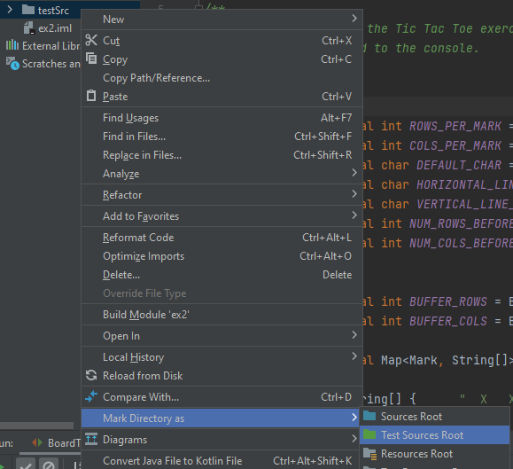
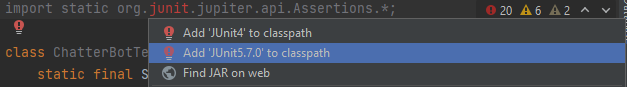
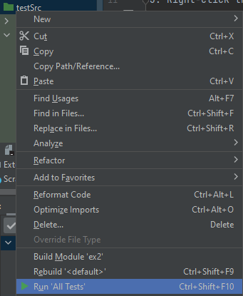

<B> Updates Notes (14.11.2022): </B>
Just those 4 files got changed so they will work with the Ex02 for OOP 22/23 Semester A. 
(There are more but they probably not fits to our exercise).   
**Improtant** (there are some test which might fail):
At PlayersFactory tests its will check if argument like: "HuMan" work, but if you dealed with uppercase letters
at the player argument at another class (which is not PlayerFactory) then some of the tests are 
going to fail, so don't worry its fine as long you took care of that (uppercase players arguments).

**Erel was stuents of the course last year (22/21) and write those tests back then  **
**The tests here are not comprehensive at all so don't rely just on them**

# OOP Ex2 Tests
featured in Exercise 2 of the new "Introduction to OOP" course,
HUJI, Winter 2021-2022 Semester. \
Written by Erel Debel.

<B>↓↓ Instructions at the bottom ↓↓</B>

<B>Important info about CleverPlayerTest and SnartypamtsPlayerTest:</B>
	
Pay attention to the documentation. without any change these classes solely test using the current Board.SIZE and Board.WIN_STREAK values. As documented in these classes it is recommended you <B>temporarily</B> remove the _final_ modifiers from these constant and uncomment the test methods in these classes for a full test of the wanted Win/Lose ratio.
	
The test support the printing in _Tournament.playTournament_ as defined in the forum: "=== player 1: %d | player 2: %d | Draws: %d ===\r"
 
========================================================================================

<B>The tests can be configured and run by:</B>
1. Put the test directory, _testSrc_, in your project directory (in the same directory as "src" and "out"):

    
	
2. Open the project in _IntelliJ_ if you haven't yet. 

3. Right-click the _testSrc_ directory and choose  
  _Mark Directory as -> Test Sources Root_:
  
	
  
4. Open the file _BoardTest.java_ inside the _testSrc_ directory.

5. On the first line' hover mouse over the red text and press _Alt+Enter_:
 
	

6. Then choose _JUnit 5_:
  
	
  
7. Right-click _testSrc_ directory or press _Ctrl+Shift+F10_ to run all tests:

	

Good luck!\
Erel
